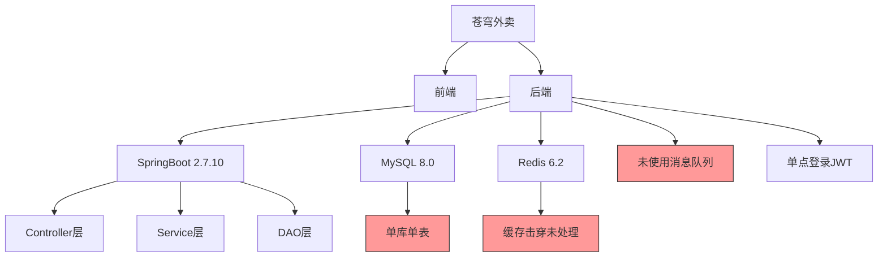

# 现状
## 架构可视化

```mermaid
graph TD
    A[苍穹外卖] --> B[前端]
    A --> C[后端]
    C --> D[SpringBoot 2.7.10]
    C --> E[MySQL 8.0]
    C --> F[Redis 6.2]
    C --> G[未使用消息队列]
    C --> H[单点登录JWT]
    
    D --> I[Controller层]
    D --> J[Service层]
    D --> K[DAO层]
    
    E --> L[单库单表]
    F --> M[缓存击穿未处理]
    
    style G fill:#ff9999,stroke:#333
    style L fill:#ff9999,stroke:#333
    style M fill:#ff9999,stroke:#333
```

